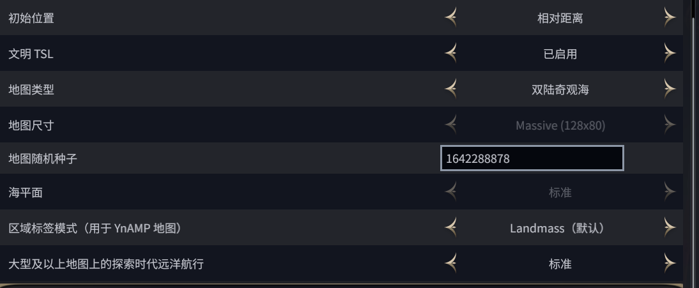

# Shattered Wonder Seas

A Civilization VII YnAMP fixed-map mod focused on handcrafted world layout,
curated natural wonders, and deterministic true-start behavior.

## Project Summary

This project builds two massive custom maps for Civilization VII, with the
primary showcase map, **Twin Discovery Wonder Seas**, designed around a central
Isabella island between two exploration-separated continents.

The map uses YnAMP's fixed-map loader, true-start-location tables, and custom
natural-wonder placement data, then layers additional terrain stabilization logic
to keep starts, rivers, terrain, and natural-wonder footprints reliable across
game generation.

## Screenshots

These screenshots show the in-game setup entries used while testing the custom
maps and YnAMP options.




## Highlights

- Massive 128x80 fixed map for Civilization VII.
- Two major continents separated by deep ocean exploration routes.
- A central Isabella start island with shallow-sea access, lakes, bays, rivers,
  desert, tropical, and temperate terrain.
- Curated placement for 19 natural wonders, including the seven production-focused
  wonders on or around the home island.
- Custom terrain generation for irregular continents, satellite islands, inland
  seas, shallow channels, and long navigable river systems.
- True-start-location tuning for many civilizations so AI players spawn on the
  two main continents rather than on the home island or satellite islands.
- Localized English and Simplified Chinese map text.
- Mod packaging for the Civilization VII Mods directory, with only `base-standard`
  and `ged-ynamp` as hard dependencies.

## Technical Work

- Implemented fixed-map data generation in JavaScript using Civ VII terrain row
  structures.
- Added deterministic post-processing passes for coastlines, river edges, island
  separation, wonder terrain support, and start-plot stability.
- Used XML and SQL database updates to register maps, true-start positions, custom
  natural-wonder anchors, and relaxed placement constraints for curated wonders.
- Iterated around engine-specific placement rules for waterfall, coast, deep-ocean,
  multi-tile, and DLC-dependent natural wonders.
- Debugged save/load dependency issues caused by optional DLC modules being treated
  as hard mod dependencies.

## Design Notes

The design target was not a balanced Earth replacement. It was a directed
scenario map built around a specific early-game fantasy: Isabella starts on a
central island with unusually dense natural-wonder access, but the rest of the
world still needs to feel like a real strategic space instead of a decorative
showcase.

The final layout uses three layers of constraint:

- The home island is intentionally rich, irregular, and navigable, with shallow
  access to one continent so the player has early contact and expansion pressure.
- The second continent is separated by deep ocean so it becomes an exploration-era
  discovery rather than an immediate ancient-era neighbor.
- AI starts are steered onto the two large continents so most opponents develop
  normal mainland economies while the player begins from a more unusual island
  position.

Most tuning work went into making the map hold its shape after Civ VII and YnAMP
applied their own terrain validation, feature placement, river, coast, resource,
and start-position systems. The natural-wonder placement code is therefore more
defensive than decorative: several passes exist only to keep engine placement
rules from silently moving or rejecting curated wonders.

## Installation

Install YnAMP for Civilization VII first.

Then copy the `shattered-wonder-seas` folder to:

```text
%localappdata%\Firaxis Games\Sid Meier's Civilization VII\Mods
```

After launching the game, enable the mod and select one of the added maps:

- `Shattered Wonder Seas`
- `Twin Discovery Wonder Seas`

## Current Status

The current build is playable and tuned for a 10-player massive map setup. Old
save files may retain earlier mod dependency metadata, so new test games are
recommended after updating the mod.

See [CHANGELOG.md](CHANGELOG.md) for the reconstructed version history.

## Repository Layout

```text
shattered-wonder-seas/
  config/          Civ VII map selection and option registration
  data/            Start positions, natural wonders, and SQL placement tuning
  maps/            Fixed-map JavaScript generation scripts
  text/            English and Simplified Chinese localization
  *.modinfo        Civ VII mod package metadata
```
